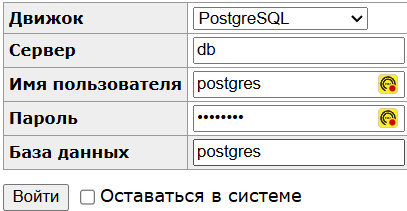

# User_accounts

[](https://github.com/alexpro2022/user_account/actions/workflows/flow_ci_cd.yaml)
[](https://github.com/alexpro2022/user_account/actions/workflows/flow_branch_test.yaml)
[](https://github.com/alexpro2022/user_account/actions/runs/14705769842/job/41265774425#step:7:306)

<br>

Проект развернут на удаленном сервере.
Техническая документация:
  - Swagger: http://185.221.162.231:8000/docs
  - Redoc: http://185.221.162.231:8000/redoc

<!-- Для разработки используются эндпойнты по адресу:
http://185.221.162.231:8000/docs#/Development<br>
Сервисные эндпойнты по адресу:
http://185.221.162.231:8000/docs#/Secrets<br> -->

Администрирование БД может быть осуществлено через админ панель по адресу:
http://185.221.162.231:8001<br>
<details><summary>Учетные данные для входа в админ-зону</summary><br>

Пароль: `postgres`<br>



<h1></h1>
</details>


<br>


## Оглавление
- [Технологии](#технологии)
- [Описание работы](#описание-работы)
- [Установка приложения](#установка-приложения)
- [Разработка в Docker](#разработка-в-Docker)
- [Удаление приложения](#удаление-приложения)
- [Автор](#автор)

<br>


## Технологии
<details><summary>Подробнее</summary><br>

[](https://www.python.org/)
[](https://fastapi.tiangolo.com/)
[](https://docs.pydantic.dev/)
[](https://www.postgresql.org/)
[](https://pypi.org/project/asyncpg/)
[](https://www.sqlalchemy.org/)
[](https://alembic.sqlalchemy.org/en/latest/)
[](https://www.uvicorn.org/)
[](https://www.docker.com/)
[](https://docs.docker.com/compose/)
[](https://hub.docker.com/)
[](https://docs.github.com/en/actions)
[](https://www.python-httpx.org/)
[](https://docs.pytest.org/en/latest/)
[](https://pypi.org/project/pytest-asyncio/)
[](https://pytest-cov.readthedocs.io/en/latest/)
[](https://pre-commit.com/)
[](https://factoryboy.readthedocs.io/en/stable/index.html)
[](https://pypi.org/project/app-toolkit-package/)

<h1></h1>
</details>
<br>


## Описание работы:
<details><summary>Подробнее</summary><br>

#### Реализована работа со следующими сущностями:
  ☑ Пользователь<br>
  ☑ Администратор<br>
  ☑ Счет - имеет баланс, привязан к пользователю<br>
  ☑ Платеж(пополнение баланса) - хранит уникальный идентификатор и сумму пополнения счета пользователя<br>

#### Пользователь имеет следующие возможности:
  ☑ Авторизоваться по email/password<br>
  ☑ Получить данные о себе(id, email, full_name)<br>
  ☑ Получить список своих счетов и балансов<br>
  ☑ Получить список своих платежей<br>

#### Администратор дополнительно может:
  ☑ Получить список пользователей<br>
  ☑ Получить/Создать/Удалить/Обновить пользователя<br>
  ☑ Получить список счетов пользователя с балансами<br>
  ☑ Получить список платежей пользователя<br>

#### Для работы с платежами реализован роут эмулирующий обработку вебхука от сторонней платежной системы. При обработке вебхука необходимо:
  ☑ Проверить подпись объекта<br>
  ☑ Проверить существует ли у пользователя такой счет - если нет, его необходимо создать<br>
  ☑ Начислить сумму транзакции на счет пользователя<br>
  ☑ Сохранить транзакцию в базе данных<br>

### Создание и редактирование пользователей, счетов и платежей:

#### Администратор создается при первом запуске приложения по учетным данным из **.env**-файла, по умолчанию:
  ```bash
  EMAIL=admin@admin.com
  PASSWORD=admin_pwd
  FIRST_NAME=admin
  LAST_NAME=admin
  PHONE_NUMBER=+79991112233
  ```

БД заполнена тестовыми данными:
  * Пользователи - 3
  * Счета - 3 на каждого пользователя (итого 9)
  * Платежи - 3 на каждый счет (итого 27)

  #### Пользователь может быть создан с любыми правами.
  - Данные для создания:
  ```json
  {
    "email": "user@user.com",
    "password": "user_pwd",
    "first_name": "user_name",
    "last_name": "user_surname",
    "phone_number": "+79211234567",
    "role": "USER"
  }
  ```
  - и редактирования:

  ```json
  {
    "first_name": "alex",
    "last_name": "pro",
    "phone_number": "+79213452402",
    "role": "ADMIN"
  }
  ```


[⬆️Оглавление](#оглавление)

<h1></h1>
</details>
<br>


## Установка приложения:
Клонируйте репозиторий с GitHub и введите данные для переменных окружения (значения даны для примера, но их можно оставить):

```bash
git clone https://github.com/alexpro2022/user_account.git
cd user_account
cp .env.example .env
nano .env
```
Все последующие команды производятся из **корневой** директории проекта.

[⬆️Оглавление](#оглавление)

<br>


## Разработка в Docker:
<!-- <details><summary>Запуск приложения</summary><br> -->
   <details><summary>Предварительные условия</summary><br>

   Предполагается, что пользователь установил [Docker](https://docs.docker.com/engine/install/) и [Docker Compose](https://docs.docker.com/compose/install/) на локальной машине. Проверить наличие можно выполнив команды:

   ```bash
   docker -v && docker compose version
   ```
   <h1></h1>
   </details>
<br>

1. Запуск тестов - после прохождения тестов в консоль будет выведен отчет `pytest` и `coverage`(**xx%**):
```bash
docker compose -f docker/dev/test.docker-compose.yaml --env-file .env up --build --abort-on-container-exit && \
docker compose -f docker/dev/test.docker-compose.yaml --env-file .env down --volumes && docker system prune -f
```
<br>

2. Запуск приложения - проект будет развернут в docker-контейнерах по адресу http://localhost:8000/docs:
```bash
docker compose -f docker/dev/docker-compose.yaml --env-file .env up --build --detach
```
Для работы удобно использовать режим режим разработки:
```bash
docker compose -f docker/dev/docker-compose.yaml --env-file .env watch --prune --quiet
```
<br>

3. Остановить docker и удалить контейнеры можно командой:
```bash
docker compose -f docker/dev/docker-compose.yaml --env-file .env down && docker system prune -f
```

Если также необходимо удалить том базы данных:
```bash
docker compose -f docker/dev/docker-compose.yaml --env-file .env down --volumes && docker system prune -f
```

[⬆️Оглавление](#оглавление)

<br>


## Удаление приложения:
```bash
cd .. && rm -fr user_account
```

[⬆️Оглавление](#оглавление)

<br>


## Автор:
[Aleksei Proskuriakov](https://github.com/alexpro2022)

[⬆️В начало](#user_accounts)
